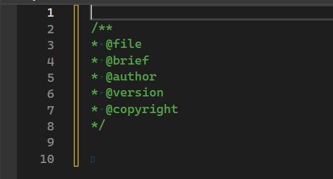

# CPP Doxygen Snippet
---

## Set up for Visual Studio
1. Download snippet files in a certain folder.
2. Open Visual Studio.
3. Create a C++ project.
4. Tools > Code Snippets Manager

5. Select Visual C++

6. Click Add
7. Select the folder that contains the snippet files.

## How to use
1. Enter a commdand such as PrefixComments.

2. Press tab.
